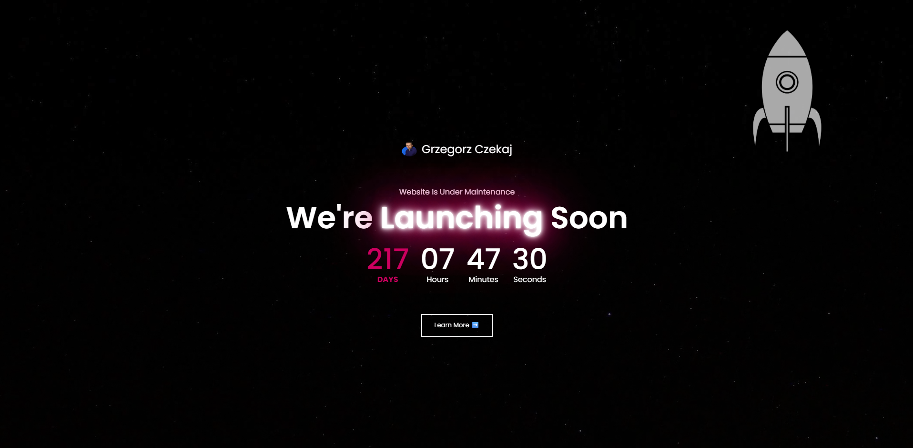

# 🌌 Coming Soon Page

[](https://developer.mozilla.org/en-US/docs/Web/HTML)
[](https://developer.mozilla.org/en-US/docs/Web/CSS)
[](./LICENSE)
[](https://pages.github.com/)

A simple **Coming Soon** landing page with a **space / stars theme**, featuring a video background and responsive design. Perfect as a placeholder while your website is under development.

---

## 🚀 Live Demo

https://g4ieku.github.io/Coming-Soon-Page/



---

## ✨ Features

- 🎥 Full-screen **video background** (stars / space atmosphere)  
- 🛰️ Custom favicon and image assets  
- 📱 Responsive layout with pure **HTML & CSS**  
- ⚡ Lightweight — no frameworks or heavy dependencies  

---

## 📂 File Structure
- **index.html** → Main markup  
- **style.css** → Custom styling  
- **.mp4** → Background video  
- **.png** → Image assets (spaceship + favicon)  

---

## 🔧 Usage

1. Clone the repository  
   ```bash
    git clone https://github.com/g4ieku/Coming-Soon-Page.git
2. Replace the video, favicon, and images with your own
3. Customize colors, fonts, and layout in style.css
4. Deploy to your hosting service (GitHub Pages, Netlify, Vercel, etc.)

---

## 💡 Customization Ideas
- ⏳ Add a countdown timer
- ✉️ Include an email subscription form
- 🔗 Add social media links
- ♿ Improve accessibility (alt text, ARIA labels)
- 📱 Enhance mobile experience

---

## 🤝 Contributing

**Contributions are welcome!**
Open an issue or submit a pull request if you’d like to improve this project.
